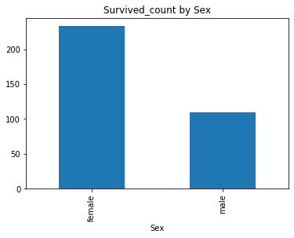
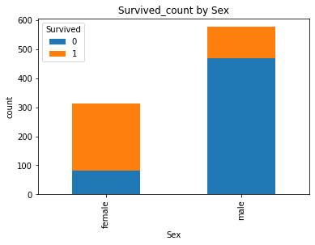
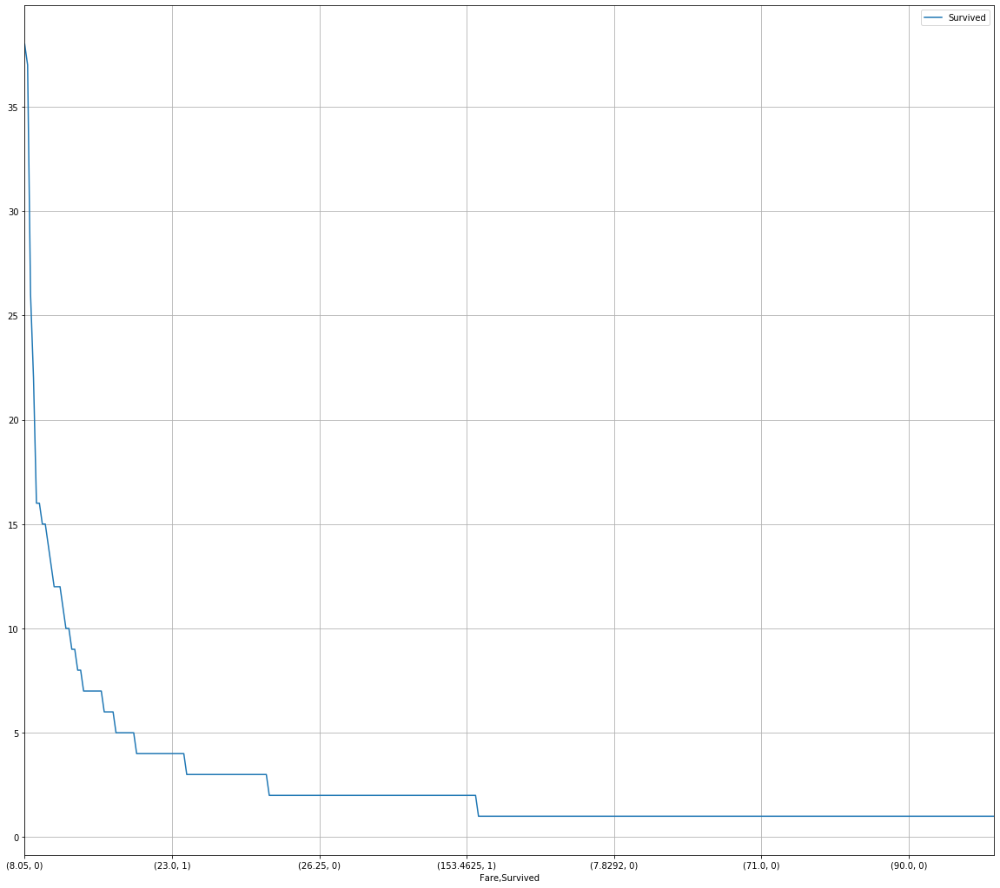
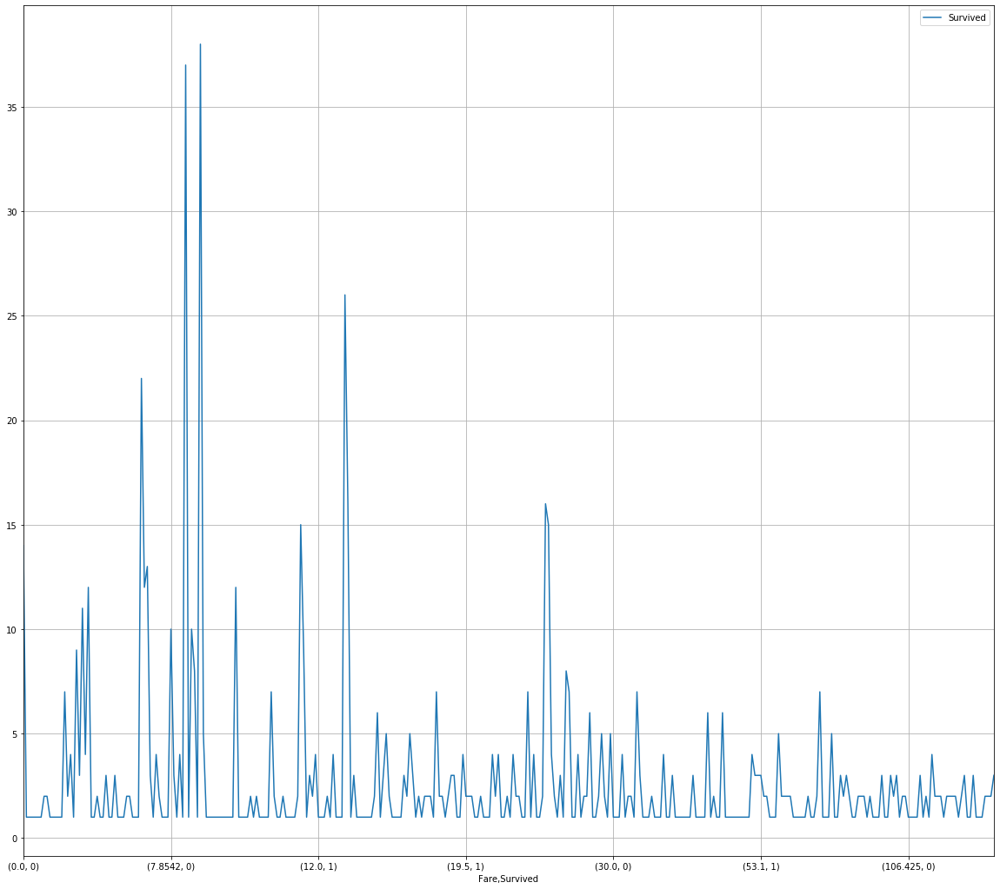
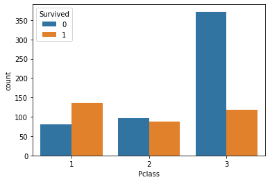
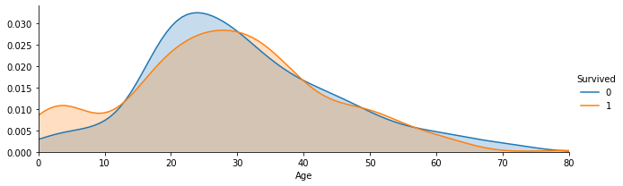
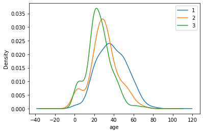

**复习：**回顾学习完第一章，我们对泰坦尼克号数据有了基本的了解，也学到了一些基本的统计方法，第二章中我们学习了数据的清理和重构，使得数据更加的易于理解；今天我们要学习的是第二章第三节：**数据可视化**，主要给大家介绍一下Python数据可视化库Matplotlib，在本章学习中，你也许会觉得数据很有趣。在打比赛的过程中，数据可视化可以让我们更好的看到每一个关键步骤的结果如何，可以用来优化方案，是一个很有用的技巧。

# 2 第二章：数据可视化

#### 开始之前，导入numpy、pandas以及matplotlib包和数据


```python
# 加载所需的库
# 如果出现 ModuleNotFoundError: No module named 'xxxx'
# 你只需要在终端/cmd下 pip install xxxx 即可
%matplotlib inline
import numpy as np
import pandas as pd
import matplotlib.pyplot as plt
```

作为一个平时用惯了pycharm的老混子用惯了plt.show()，对于加上%matplotlib inline有很大的疑问，所以今天就百度了一下。
%matplotlib inline的作用是功能是可以内嵌绘图,不使用%matplotlib inline的话输出为类型及内存地址，加上以后就会内嵌图像。


```python
#加载result.csv这个数据
res = pd.read_csv('result.csv')
res.head()
```


<div>
<style scoped>
    .dataframe tbody tr th:only-of-type {
        vertical-align: middle;
    }

    .dataframe tbody tr th {
        vertical-align: top;
    }

    .dataframe thead th {
        text-align: right;
    }
</style>
<table border="1" class="dataframe">
  <thead>
    <tr style="text-align: right;">
      <th></th>
      <th>Unnamed: 0</th>
      <th>PassengerId</th>
      <th>Survived</th>
      <th>Pclass</th>
      <th>Name</th>
      <th>Sex</th>
      <th>Age</th>
      <th>SibSp</th>
      <th>Parch</th>
      <th>Ticket</th>
      <th>Fare</th>
      <th>Cabin</th>
      <th>Embarked</th>
    </tr>
  </thead>
  <tbody>
    <tr>
      <td>0</td>
      <td>0</td>
      <td>1</td>
      <td>0</td>
      <td>3</td>
      <td>Braund, Mr. Owen Harris</td>
      <td>male</td>
      <td>22.0</td>
      <td>1.0</td>
      <td>0.0</td>
      <td>A/5 21171</td>
      <td>7.2500</td>
      <td>NaN</td>
      <td>S</td>
    </tr>
    <tr>
      <td>1</td>
      <td>1</td>
      <td>2</td>
      <td>1</td>
      <td>1</td>
      <td>Cumings, Mrs. John Bradley (Florence Briggs Th...</td>
      <td>female</td>
      <td>38.0</td>
      <td>1.0</td>
      <td>0.0</td>
      <td>PC 17599</td>
      <td>71.2833</td>
      <td>C85</td>
      <td>C</td>
    </tr>
    <tr>
      <td>2</td>
      <td>2</td>
      <td>3</td>
      <td>1</td>
      <td>3</td>
      <td>Heikkinen, Miss. Laina</td>
      <td>female</td>
      <td>26.0</td>
      <td>0.0</td>
      <td>0.0</td>
      <td>STON/O2. 3101282</td>
      <td>7.9250</td>
      <td>NaN</td>
      <td>S</td>
    </tr>
    <tr>
      <td>3</td>
      <td>3</td>
      <td>4</td>
      <td>1</td>
      <td>1</td>
      <td>Futrelle, Mrs. Jacques Heath (Lily May Peel)</td>
      <td>female</td>
      <td>35.0</td>
      <td>1.0</td>
      <td>0.0</td>
      <td>113803</td>
      <td>53.1000</td>
      <td>C123</td>
      <td>S</td>
    </tr>
    <tr>
      <td>4</td>
      <td>4</td>
      <td>5</td>
      <td>0</td>
      <td>3</td>
      <td>Allen, Mr. William Henry</td>
      <td>male</td>
      <td>35.0</td>
      <td>0.0</td>
      <td>0.0</td>
      <td>373450</td>
      <td>8.0500</td>
      <td>NaN</td>
      <td>S</td>
    </tr>
  </tbody>
</table>
</div>


### 2.7 如何让人一眼看懂你的数据？
《Python for Data Analysis》第九章

#### 2.7.1 任务一：跟着书本第九章，了解matplotlib，自己创建一个数据项，对其进行基本可视化

【思考】最基本的可视化图案有哪些？分别适用于那些场景？（比如折线图适合可视化某个属性值随时间变化的走势）

   常用的可视化图表有折线图、散点图、直方图、柱形图等。
   ### 直方图
   
   ### 箱线图
   
   ### 小提琴图
   
   ### 条形图
   
   ### 折线图
   
   ### 堆叠柱状图
   
   ### 散点图
   
   ### 饼状图
   
   ### 热度图
   
   
   1. 其中热度图可以应用于如人流密度可视化等；
   2. 散点图常用于显示和比较跨类别的聚合数据，且数据量越多，散点图的效果也会越明显，应用于分析餐厅经营数据等类似场景。
   3. 箱线图，该图信息量较大，不仅能够分析不同类别数据平均水平差异（需在箱线图中加入均值点），还能揭示数据间离散程度、异常值、分布差异等等。
   4. 折线图，表现某事物、某指标随时间的变化情况，还可以用来绘制各种数学函数图像。可应用于显示公司产品每天活跃用户或下载量等场景。

#### 2.7.2 任务二：可视化展示泰坦尼克号数据集中男女中生存人数分布情况（用柱状图试试）。


```python
#代码编写
sex = res.groupby('Sex')['Survived'].sum()
sex.plot.bar()
plt.title('Survived_count by Sex')
plt.show()

```





【思考】计算出泰坦尼克号数据集中男女中死亡人数，并可视化展示？如何和男女生存人数可视化柱状图结合到一起？看到你的数据可视化，说说你的第一感受（比如：你一眼看出男生存活人数更多，那么性别可能会影响存活率）。

思考题回答

但从数据可视化后的图可知，生存人数中女性的人数大概是男性的两倍，但从这点分析女性的存活率要高一些。但如果从实际来说，优先让妇女和孩子先走的措施也使得女性的存活率较高。


#### 2.7.3 任务三：可视化展示泰坦尼克号数据集中男女中生存人与死亡人数的比例图（用柱状图试试）。


```python
#代码编写
# 提示：计算男女中死亡人数 1表示生存，0表示死亡
res.groupby(['Sex','Survived'])['Survived'].count().unstack().plot(kind='bar',stacked='True')
plt.title('Survived_count by Sex')
plt.ylabel('count')


```


    Text(0, 0.5, 'count')





【提示】男女这两个数据轴，存活和死亡人数按比例用柱状图表示

#### 2.7.4 任务四：可视化展示泰坦尼克号数据集中不同票价的人生存和死亡人数分布情况。（用折线图试试）（横轴是不同票价，纵轴是存活人数）

【提示】对于这种统计性质的且用折线表示的数据，你可以考虑将数据排序或者不排序来分别表示。看看你能发现什么？


```python
#代码编写
# 计算不同票价中生存与死亡人数 1表示生存，0表示死亡
tic_price_effect = res.groupby(['Fare'])['Survived'].value_counts().sort_values(ascending=False)
tic_price_effect
```


    Fare     Survived
    8.0500   0           38
    7.8958   0           37
    13.0000  0           26
    7.7500   0           22
    26.0000  0           16
                         ..
    20.2500  1            1
             0            1
    18.7875  1            1
             0            1
    15.0500  0            1
    Name: Survived, Length: 330, dtype: int64


```python
fig = plt.figure(figsize=(20, 18))
tic_price_effect.plot(grid=True)
plt.legend()
plt.show()
```





```python
# 排序前绘折线图
tic_price_effect1 = res.groupby(['Fare'])['Survived'].value_counts()
tic_price_effect1
```


    Fare      Survived
    0.0000    0           14
              1            1
    4.0125    0            1
    5.0000    0            1
    6.2375    0            1
                          ..
    247.5208  1            1
    262.3750  1            2
    263.0000  0            2
              1            2
    512.3292  1            3
    Name: Survived, Length: 330, dtype: int64


```python
fig = plt.figure(figsize=(20, 18))
tic_price_effect1.plot(grid=True)
plt.legend()
plt.show()
```





#### 2.7.5 任务五：可视化展示泰坦尼克号数据集中不同仓位等级的人生存和死亡人员的分布情况。（用柱状图试试）


```python
#代码编写
# 1表示生存，0表示死亡
pclass_sur = res.groupby(['Pclass'])['Survived'].value_counts()
pclass_sur
```


    Pclass  Survived
    1       1           136
            0            80
    2       0            97
            1            87
    3       0           372
            1           119
    Name: Survived, dtype: int64


```python
import seaborn as sns
sns.countplot(x="Pclass", hue="Survived", data=res)
```


    <matplotlib.axes._subplots.AxesSubplot at 0x1cfb05efa08>





【思考】看到这个前面几个数据可视化，说说你的第一感受和你的总结

思考题回答

可以看出相对来说等级越高存活率更高，更优先得到救援。

#### 2.7.6 任务六：可视化展示泰坦尼克号数据集中不同年龄的人生存与死亡人数分布情况。(不限表达方式)


```python
by_age = sns.FacetGrid(res, hue="Survived",aspect=3)
by_age.map(sns.kdeplot,'Age',shade= True)
by_age.set(xlim=(0, res['Age'].max()))
by_age.add_legend()
```


    <seaborn.axisgrid.FacetGrid at 0x1cfb0663748>





#### 2.7.7 任务七：可视化展示泰坦尼克号数据集中不同仓位等级的人年龄分布情况。（用折线图试试）


```python
res.Age[res.Pclass == 1].plot(kind='kde')
res.Age[res.Pclass == 2].plot(kind='kde')
res.Age[res.Pclass == 3].plot(kind='kde')
plt.xlabel("age")
plt.legend((1,2,3),loc="best")
```


    <matplotlib.legend.Legend at 0x1cfb05c67c8>





【思考】上面所有可视化的例子做一个总体的分析，你看看你能不能有自己发现

从上面的几个例子可以看出如下问题：

1. 女性的存活率比男性高；
2. 舱位等级高的人比等级低的人存活率低；
3. 年纪大的人乘坐舱位等级高的舱位占比较高。

【总结】到这里，我们的可视化就告一段落啦，如果你对数据可视化极其感兴趣，你还可以了解一下其他可视化模块，如：pyecharts，bokeh等。

如果你在工作中使用数据可视化，你必须知道数据可视化最大的作用不是炫酷，而是最快最直观的理解数据要表达什么，你觉得呢？

### 参考

1. [超实用！用Python进行数据可视化的9种常见方法！](https://zhuanlan.zhihu.com/p/36014582)